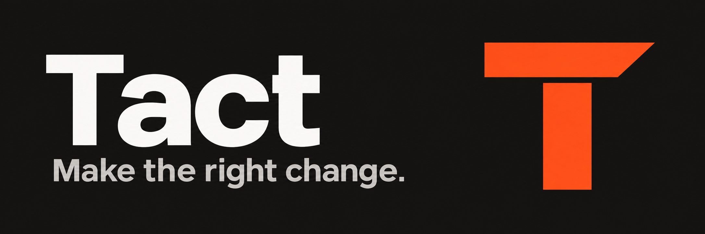

<p align="center">
  
</p>

# Tact

**Make the right change.**

Tact is an engineering skill for making the right change: understand the task, choose a simple solution, keep changes focused, and verify the result.

Use it for implementation, debugging, refactoring, planning, code review, and engineering decision records.

**Version 0.0.5.** [Installation](#installation) · [Usage](#use) · [Documentation](#documentation)

## Installation

### Install as a Codex plugin

With Git and a Codex CLI that supports plugins:

```bash
codex plugin marketplace add awesomelon/tact
codex plugin add tact@tact
```

Start a new conversation and use `$tact`. Use the skill name displayed by Codex if it includes a plugin prefix.

### Install as a Claude Code plugin

With Git and a Claude Code CLI that supports plugins:

```bash
claude plugin marketplace add awesomelon/tact
claude plugin install tact@tact
```

Restart Claude Code and use `/tact:tact`.

For either host, run the second command after the first succeeds. These commands install the **published GitHub version**. To test an unpublished revision, use the [local checkout procedure](docs/plugin.md#test-a-local-checkout).

Both plugins package the same `skills/` source as the standalone installer and use the host's existing tools. They install no agent runtime, hooks, MCP server, model settings, or lint dependency.

See [installation and updates](docs/installation.md) for verification, updates, and removal. The [macOS standalone installer](docs/installation.md#standalone-installation-on-macos) is also available for Codex and requires no Python.

## Use

Invoke Tact using the syntax in the [installation instructions](#installation), then describe the outcome you need. Each example is an independent request:

| Task | Example request |
| --- | --- |
| Debugging | Fix this save-and-reload bug and verify the repair. |
| Code review | Review this change for correctness and unnecessary complexity. Do not edit files. |
| Planning | Plan this migration and explain the tradeoffs before implementation. |
| Refactoring | Refactor this parser while preserving its public behavior. |
| Implementation with documentation | Implement this storage change and preserve the decision rationale. |
| Decision records | Record our agreed API compatibility policy as an ADR. Do not change the implementation. |

The requested outcome sets the scope. Planning and review preserve the assessed material. Implementation carries through the authorized change and relevant checks; there is no required assessment stage before coding.

During implementation, Tact keeps affected documentation current and preserves missing context needed to prevent mistaken changes or repeated investigation. It reuses existing documentation and creates an ADR only when the rationale needs an independent record. Documentation-only requests produce the requested artifact without implementing the decision.

## Four principles

| Principle | What it changes |
| --- | --- |
| **Understand before acting.** | Investigate available facts, expose consequential assumptions, and clarify intent when different outcomes remain plausible. |
| **Prefer the simplest sufficient solution.** | Use existing capabilities, preserve useful information, and add complexity only for a concrete need. |
| **Keep changes tied to the request.** | Repair the responsible code and necessary consumers while preserving unrelated work and behavior. |
| **Work toward an observable result.** | Define success, check the relevant final state, and limit completion claims to the evidence. |

Tact leads with the result, describes concrete changes and evidence, and keeps project terms consistent. Reports use the format and depth the request needs, including important conditions and limitations. Concise reporting does not reduce the scope of the work.

## Included skill

| Skill | Purpose |
| --- | --- |
| [tact](skills/tact/SKILL.md) | Engineering work with explicit assumptions, focused changes, code-quality guidance, verification, and documentation that preserves decision context. |

The skill loads supporting guidance when relevant:

| Guide | Covers |
| --- | --- |
| [Code evidence](skills/tact/references/code-evidence.md) | TypeScript and JavaScript contracts, assertions, collections, testing seams, and a dedicated reference for Effect projects. |
| [Decision documentation](skills/tact/references/decision-documentation.md) | Record selection, existing documentation conventions, and ADR history. |
| [Verification](skills/tact/references/verification.md) | Regression evidence and completion claims. |
| [Communication](skills/tact/references/communication.md) | Concise reports, requested depth, and exact output formats. |

## Documentation

- [Installation and updates](docs/installation.md)
- [Plugin packaging](docs/plugin.md)
- [Contributing and validation](CONTRIBUTING.md)
- [Evaluation scenarios and evidence](evals/README.md)

## License

[MIT](LICENSE).
