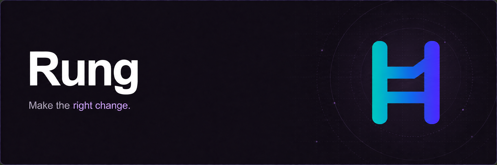

<p align="center">
  
</p>

# Rung

[English](README.md) · **한국어**

**Make the right change. — 올바른 변경을 만듭니다.**

Rung은 Codex의 엔지니어링 판단을 돕는 지침을 제공합니다. 문제를 이해합니다. 필요한 변경을 선택합니다. 결과를 검증합니다.

## 왜 Rung인가

원인을 해결하지 않은 수정도 테스트를 통과할 수 있습니다. 작은 수정이 불필요한 전면 재작성으로 커질 수 있습니다. 완료 보고에서 중요한 검증이 빠질 수 있습니다.

Rung은 Codex가 이런 상황에서 판단하도록 돕습니다. 필요한 작업에 사용할 기술 참조 문서도 제공합니다.

| 상황 | Rung이 Codex에 요구하는 작업 |
| --- | --- |
| 제안된 진단이 틀릴 수 있습니다. | 수정 방법을 선택하기 전에 현재 코드에서 원인을 확인합니다. |
| 변경이 여러 모듈에 영향을 줍니다. | 원인을 담당하는 모듈에서 수정합니다. 변경 범위를 설명합니다. 독립적으로 바뀌어야 하는 책임은 분리된 상태로 유지합니다. |
| 작업에 기존 진단이나 계획이 있습니다. | 현재도 유효한 근거를 재사용합니다. 달라진 조건을 조사합니다. |
| 작업이 끝났다는 근거가 필요합니다. | 실제 수행한 검증을 보고합니다. 확인하지 못한 부분을 명시합니다. |

수정 없이 검토하려면 **Get Set**을 사용하세요. 변경을 구현하고 검증하려면 **Go**를 사용하세요. 각 스킬은 독립적으로 동작합니다. Get Set을 먼저 사용하지 않아도 Go를 사용할 수 있습니다.

## 세 가지 원칙

| 원칙 | 적용 방법 |
| --- | --- |
| **문제를 이해합니다.** | 증상과 원인을 구분합니다. 변경이 목표를 어떻게 달성하는지 설명합니다. 이미 내린 결정을 재사용합니다. 사용자가 결정해야 할 중요한 사항에는 근거와 권고안을 제시합니다. |
| **문제 해결에 필요한 만큼 변경합니다.** | 한 곳의 문제는 그 위치에서 수정합니다. 공통 문제는 이를 담당하는 모듈에서 수정합니다. 요구사항, 영향을 받는 사용자나 코드, 향후 유지보수 비용으로 범위를 정합니다. 필요한 복잡성을 유지합니다. 독립적으로 바뀌어야 하는 정책은 분리된 상태로 유지합니다. |
| **결과를 검증합니다.** | 실제 수행한 검증으로 완료 여부를 설명합니다. 동작 검증, 유지보수성 판단, 측정한 성능, 남은 불확실성을 구분합니다. |

작업에 필요한 깊이로 원칙을 적용합니다. 정해진 순서를 요구하지는 않습니다. 계획 작업은 권고안으로 마칠 수 있습니다. 구현 작업에는 관련 검증을 포함합니다. 리뷰에서는 검토 대상 코드를 수정하지 않습니다.

작은 수정에는 새 명세서, 리뷰 패널, 교훈 기록이 필요하지 않습니다.

## 사용 방법

원하는 결과와 작업 범위를 명시하세요. 아래 예시는 각각 별도 요청입니다.

```text
$rung-get-set 스킬로 이 마이그레이션이 보고된 문제를 해결하는지 확인해줘.
계획을 제안해줘. 코드는 수정하지 마.

$rung-go 스킬로 저장 후 다시 불러올 때 발생하는 이 버그를 수정해줘.
수정 결과를 검증해줘.

$rung-get-set 스킬로 이 폼의 상태와 요청 처리를 리뷰해줘.
파일은 수정하지 마.
```

예를 들어 큰 모듈을 나누려면, 함께 바뀌는 부분과 독립적으로 바뀌는 부분을 먼저 확인합니다. 파일 길이만으로 경계를 정하지 않습니다. 선택한 경계, 유지보수 비용에 미치는 영향, 유지해야 할 동작을 설명합니다.

**Get Set은 판단을 돕습니다. Go는 변경을 완성합니다.** 아키텍처, 코드 품질, React, TanStack Query, TypeScript 참조 문서는 필요할 때 읽습니다.

사용 중인 앱에 표시된 스킬 이름을 사용하세요. 이름에 플러그인 접두사가 붙을 수 있습니다.

## Codex 플러그인으로 설치하기

자세한 설치와 업데이트 방법은 [설치 가이드](docs/installation.md)를 참조하세요.

Git과 플러그인 기능을 지원하는 Codex CLI가 필요합니다.

```bash
codex plugin marketplace add awesomelon/rung
codex plugin add rung@rung
```

첫 번째 명령이 성공한 뒤에 두 번째 명령을 실행하세요. 두 스킬을 **Rung** 플러그인으로 함께 설치합니다. 저장소를 복제하거나 셸 설치 스크립트를 실행할 필요는 없습니다. `codex plugin list`로 설치 상태를 확인하세요.

[설치와 업데이트](docs/installation.md) · [플러그인 구성](docs/plugin.md)

## 포함된 스킬

| 스킬 | 목적 |
| --- | --- |
| [rung-get-set](skills/rung-get-set/SKILL.md) | 검토 대상을 수정하지 않고 조사, 설계, 계획, 리뷰를 수행합니다. 성능 근거가 비교 가능한 조건에서 완료된 작업을 측정했는지 판단합니다. 공통 리뷰 기준과 관련 기술 참조 문서를 사용합니다. |
| [rung-go](skills/rung-go/SKILL.md) | 허용된 변경을 구현, 수정, 리팩터링, 재개하고 검증합니다. 유효한 진단 근거를 재사용합니다. 성능 측정의 타당성을 확인하고, 반복 실수를 적절한 구조·타입·검사로 방지합니다. 수행하지 못한 런타임 검증을 보고합니다. |

## 문서

- [가이드](docs/README.md)
- [기여 방법과 검증](CONTRIBUTING.md)
- [평가 근거](evals/README.md)

상세 문서와 스킬 지침은 영어로 제공합니다.

Rung은 [OpenAI의 스킬 작성 가이드](https://developers.openai.com/blog/rethinking-skills-and-prompts-for-gpt-6-astra)를 따릅니다. 스킬 진입 문서를 짧게 유지합니다. 세부 내용은 필요할 때 읽습니다. 작업 범위는 요청에 맞춥니다.

스태프 엔지니어에게 기대하는 판단 수준을 설계 목표로 삼습니다. 평가 기록에는 실제 검증한 내용을 명시합니다.

## 라이선스

Rung은 [MIT 라이선스](LICENSE)를 사용합니다. 제3자 자료의 원저작권 고지와 라이선스 조건은 해당 스킬 폴더에 유지합니다.
